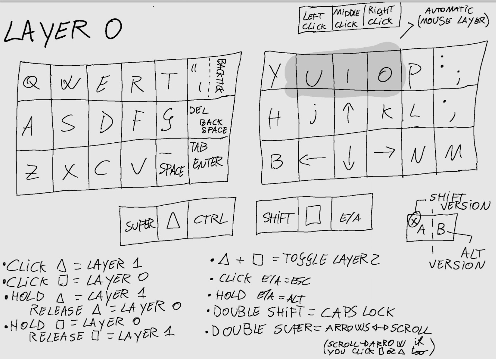
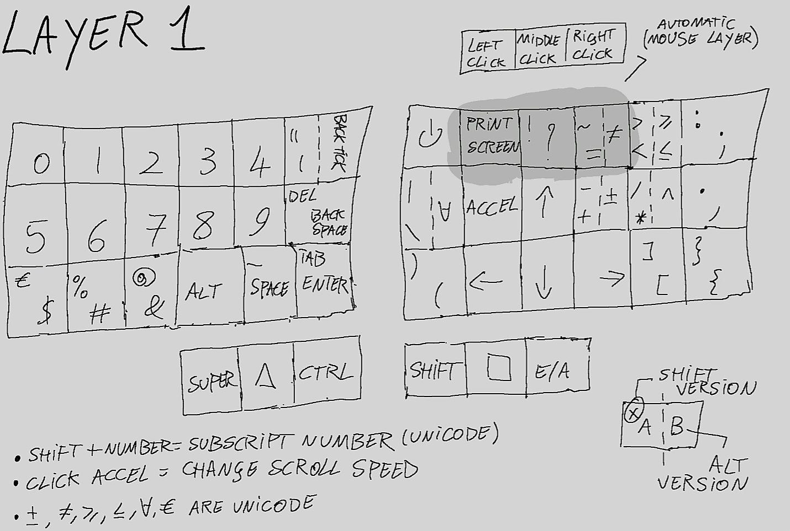
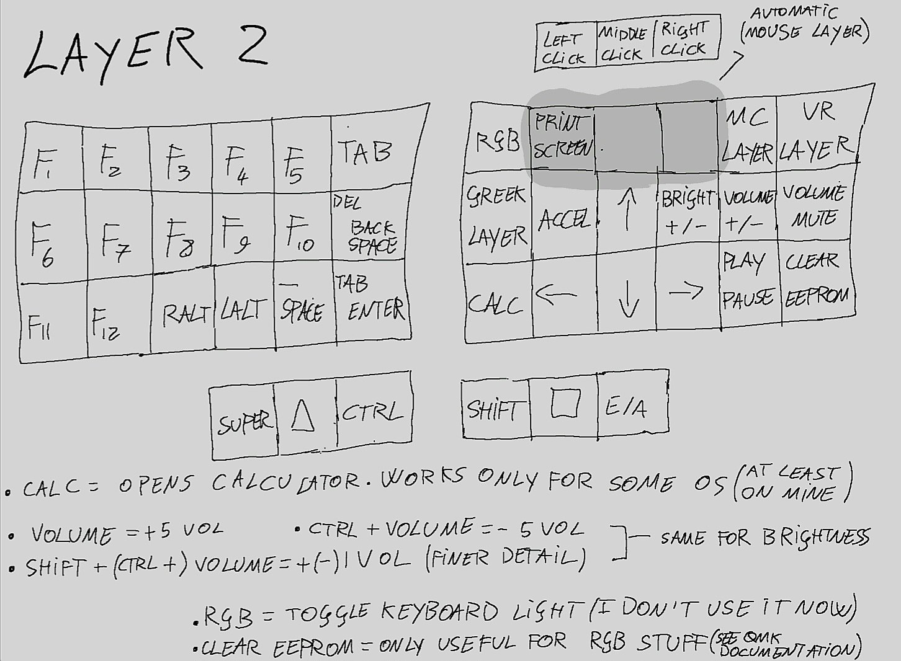
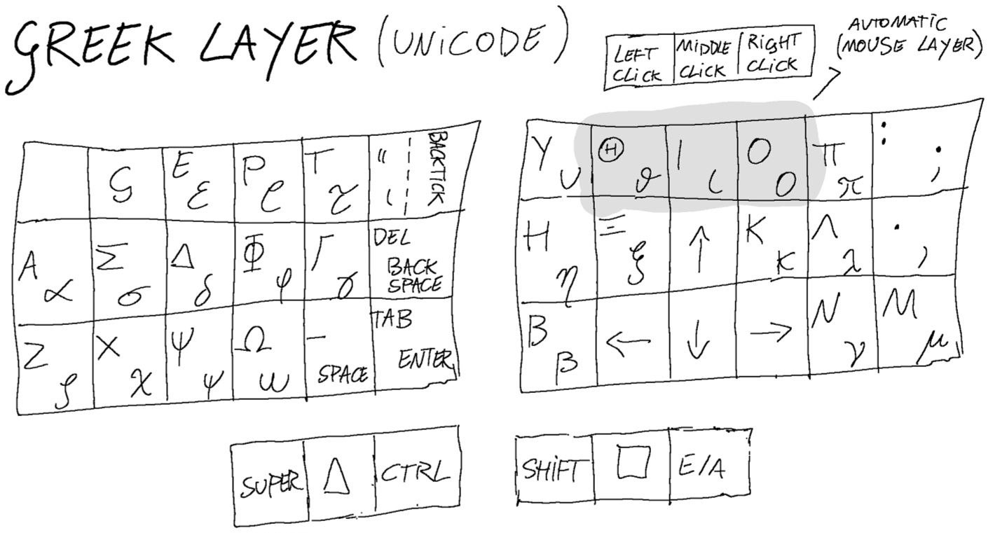
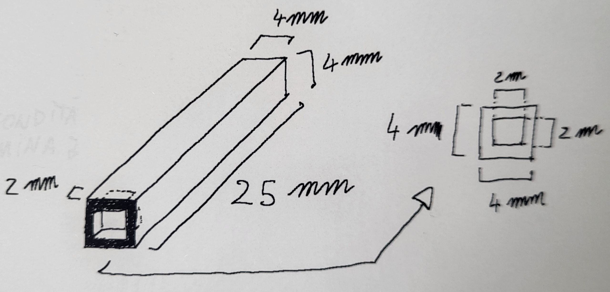
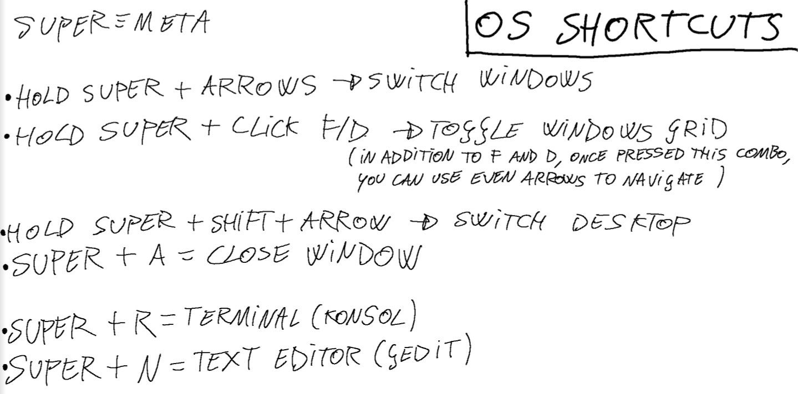

# Elil50 Corne keyboard QMK firmware


This project is subdivided as it follows:
1. An explaination of my custom firmware, written for the 6 columns [Corne keyboard](https://github.com/foostan/crkbd/) (a 42 keys ortholinear split keyboard), based on [QMK](https://github.com/qmk/qmk_firmware/) framework.
2. My hardware customization: from printable files for the case, to key switches and keycaps, and even mounting tips for the trackpoint (optional).
3. My desktop enviroment shortcuts (optional).

# Just a keyboard for show?


I coded, but my hands always felt lost on big keyboards: I couldn't learn touch typing and my eyes hurt each time I took a quick glance at the keyboard.<br/>
I coded, but my desk is comically high and I had the habit of pressing my wrists against its edges: my knuckles literally bled for months due to circulation issues. I tried using a comically high chair, but then it was my knees' turn to ache. I bought a footrest, but it didn't change anything.

That's when I went down the ergonomic keyboard rabbit hole and discovered split keyboards.

* I needed to mount it to my chair to stop worrying about the desk height.<br/>
* I needed just the right amount of keys: too few and it would reduce the typing speed, too many and I would lose my hands on it.<br/>
* I needed a split design to easily sit and stand, without moving a big rectangular slab over my legs.<br/>
* I needed a firmware framework to customize the keyboard layout to my heart's content.<br/>
* I needed a built-in pointing device to replace a standalone mouse. <br/>
* I needed something portable.

This is the solution I found and I'm learning touch typing for the first time in my life.


# :one: Keyboard firmware
When it comes to firmware, there are mainly 2 options: QMK(for wired keyboards) and ZMK(for wireless keyboards). My old laptop has a fried wireless module, so I chose the adaptability of wired over the comfort of wireless.

This was written for Corne V3. If you use a Corne V4 just add the 4 additional keys at the end of ```./Elil_50/keymap.c```. 

## Keyboard layout

This layout was optimized in 1 year for coding and typing purposes. It works only if you set the OS language input to English(US). 

The trackpoint can be disabled by turning false the flag ```MY_TRACKPOINT_ENABLE``` in ```./Elil_50/rules.mk```. This action removes the automatic mouse layer, so reduce ```MY_MAX_LAYER``` by 1 at the beginning of ```./Elil_50/keymap.c```.<br/>
This option will not affect any other functionality.

Unicode symbols can be disabled by turning false the flag ```MY_UNICODE_ENABLE``` in ```./Elil_50/rules.mk```.<br/>
This option will not affect any other functionality.

Unicode support depends on both OS and software used: most recent Linux and Mac OS do support it by default, but you need to install Wincompose for Windows (another reason to avoid it). I use gedit as text editor: I switched from Kate because it doesn't recognise unicode really well.<br/> 
The keymap I wrote does an automatic OS detection to use the right unicode input method.

In the following sketch I refer to the key ```GUI```, also called ```meta``` or ```command``` or ```windows```, as ```super``` which is just another alias.






* ### Automatic Mouse Layer

Enabled if ```MY_TRACKPOINT_ENABLE``` in ```./Elil_50/rules.mk``` is enabled. Highlighted in grey in the keyboard layout. 

Whenever you move the trackpoint and 300ms after, this layer is activated. You can change this time by changing the number of ```TURN_LAYER_OFF_TIMEOUT``` at line 584 of ```./Elil_50/keymap.c```. <br/>
The layer switching key △ or ▢ deactivates it.

TO DO (Issues with PS/2 and mouse keys interactions) 

* ### Scroll features

If you double click the key ```super``` you activate the wheel layer, which replaces arrows with scroll movements and adds the key ```accel``` which can be found by default in layer 1. <br/>
If you double click the key ```super``` again or single click the layer switching key △ or ▢, the layer is deactivated. 

If you toggle the key ```accel``` you change the scroll speed between fast and slow. You can change them by changing the numbers of the two ```MK_W_OFFSET``` in ```./Elil_50/config.h```.

* ### Overrides and combos

Override is the QMK term which refers to the usual action of holding down a modifier key like ```alt``` or ```shift``` and then clicking a key to get a new output. 

Combo is the QMK term which refers to the action of just clicking two keys together to get a new output.

I like to match combo and override outputs to increase the typing speed. Thus, in addition to holding down ```shift``` and then pressing ```a``` to get a capital ```A```, you can just click them together. By the way, if you double click ```shift``` you toggle caps lock.

Both overrides and combos are written in ```.\Elil_50\keymap.c```, just follow the comments. You can change them as you like.

## User files and changes to qmk_firmware

The main selling point of flashable keyboards is the layout customization, so get comfy with writing in the last part of ```./Elil_50/keymap.c``` (which contains the layout implementation) and flashing it: it's really easy.

Instead of remapping softwares and videogames, additional layers can be added and reached from layer 2, which is activated by clicking the layer switching keys △ and ▢ together. If you want to return to layer 0 or 1 you just need to click ▢ or △ respectively.

Be sure to place the additional layers after layer 3 (i.e. the Greek layer. Follow my comments and it will make sense). I've left undefined ```XXXXXXX``` buttons in layer 2 which can be replaced with the toggle layer key ```TG(n)``` where ```n``` is the number of your additional layer. 

This layout already has two gaming layer examples: you can understand the logic just by reading the layout implementation. 

**IMPORTANT**: Remember to change ```MY_MAX_LAYER``` at the beginning of ```./Elil_50/keymap.c``` according to the layers added or removed. Layer count starts from 0.

* ### Executables

**qmk_file_inject.sh:** injects user files (described below) in ```qmk_firmware```. 

**flash.sh:** executes ```qmk_file_inject.sh``` and ```qmk flash``` in the user keyboard folder. 

**commit_all.sh:** commits all changes, both of ```qmk_firmware``` submodule and ```crkbd_QMK module```.

Follow [QMK documentation](https://docs.qmk.fm/newbs_getting_started) for setting up your enviroment before flashing it to your keyboard. Note that Corne keyboards are called crkbd in the QMK framework. 

**IMPORTANT**: All the following actions are automatically performed by running ```./qmk_file_inject.sh```. <br/>
Before running a program, remember to change its execution permissions. For example, on Linux you run ```chmod +x program_name.sh```.  

* ### Keymap.c, rules.mk, config.h

Add the folder ``` Elil_50 ``` in the following path:
```
./qmk_firmware/keyboards/crkbd/keymaps
```

* ### PS/2 Driver Trackpoint (optional)

The host needs pull-up resistors on PS/2 DATA and CLK lines. The built-in pullup resistors from the host 4k to 100k are acceptable. 
So, I need to add those pull-up resistors (didn't do it), or apply the following patch:

Add in line 150 of file:
```
./qmk_firmware/platforms/chibios/drivers/vendor/RP/RP2040/ps2_vendor.c
```
The line ``` PAL_RP_PAD_PUE | ``` so that it looks like:
```c
    // clang-format off
    iomode_t pin_mode = PAL_RP_PAD_IE |
                        PAL_RP_GPIO_OE |
                        PAL_RP_PAD_SLEWFAST |
                        PAL_RP_PAD_DRIVE12 |
                        PAL_RP_PAD_PUE |
```

---

<br>

# :two: Keyboard Hardware
The main components are:

* 2 PCB: Helidox Corne V3, 6 columns
* 2 Microcontroller: Elite-Pi
* 1 Trackpoint: SK8707-01-002(3.3V) Integrated (optional)
* 42 key switches and keycaps

There are tons of sites who sell DIY kits and pre-builts: each one has their own well-documented and similar guide on little details I won't write here. Nowadays even aliexpress sells low cost pre-builts, but be aware they are not easily flashable.

The following files were made for Corne V3, which is not compatible with Corne V4. You can still port the ideas.

## External shell


I 3D printed [this case](https://www.printables.com/model/347524-corne-keyboard-case-5-and-6-columns) and designed for portability purposes the light grey interlocking "case wall" depicted above. Note that you don't need to unplug the TRRS cable from the keyboard (the less mechanical stress, the longer the life span). You can find its file in ```./stl_files/eiga-wall-Elil50.stl```.


## Key Switches and Keycaps
The world of key switches is really big. The important keywords you need to know are: low-profile(choc), standard profile (MX), tactile, linear, clicky, silent, lubed. I built a MX compatible one for aesthetics (most artisanal keycaps are cherry (MX) ) and bought tactile silent switches. However I forgot to check if they were pre-lubed: they were not and they feel scratchy as hell. I won't complain as I'm not building this keyboard for the mechanical switch pleasure, even though I admit the linear gateron of a friend of mine feel like heaven. 

Keycaps have an equally vast range of options: I'll show some in the image below. I bought DSA profile keycaps from Aliexpress and scratched the home rows with sandpaper (1 minute at most of handwork).


## Trackpoint (optional)

I've placed the trackpoint on the left side of the keyboard because, as a right-handed person, I need the arrows on the right side: when coding and typing I find them far more useful than mouse movements.<br/>
I suggest to buy a standalone controller for gaming sessions with a lot of cursor movements.

In the following image you can see the back of the left side of the keyboard PCB with the pinout setup. The PCB already has a mounting hole we conveniently repurpose for the trackpoint stem.

More informations about the trackpoint can be found in the official datasheet; you can ask it to Sprintek directly.


* ### Trackpoint stem

In order to raise the trackpoint keycap above the PCB, I 3D printed the following sketch. Then, I proceeded to cut the excess height and manually reduce the diameter of the section which goes through the PCB. It's probably better to print with 3mm instead of 4mm. I increased the diameter of the PCB hole with a drill. Finally I glued the stem on the trackpoint sensor: it was too shaky otherwise.

I leave just a sketch because I think a better design can be made.<br/>
Anyway, what I have now works wonderfully. 

You can find a printable Corne case with an integrated trackpoint mount [here](https://github.com/joh/crkbd-trackpoint?tab=readme-ov-file). If you are unsure about your PCB (for example with a Corne V4) or you already have a case, you can manually glue the trackpoint to it. For example I glued it to a metal plate that came with the DIY kit, screwed underneath the case mentioned in the previous sections. Just be sure to start by using some removable adhesive tape when placing the trackpoint. After a few attempts you find the right position: you don't want the stem to touch - or be too close to - the edges of the PCB hole. You can glue everything now.



---

<br>

# :three: Desktop Enviroment (KDE Plasma) (optional)


In ```KDE_Plasma``` folder you can find both monitor overview and keyboard shortcuts files. This is totally optional and it's more related to my typing experience than the keyboard.

* Replace ```./KDE_Plasma/overview.page``` in the following path:
```
.local/share/plasma-systemmonitor/overview.page
```

* Replace ```./KDE_Plasma/kglobalshortcutsrc``` in the following path:
```
.config/kglobalshortcutsrc
```

## OS Shortcuts



---

<br>

# :star2: Thanks

I thank the whole open source ergonomic mechanical keyboard community for the projects they pushed out in the world and QMK developers for their support over their discord server. A special thanks to my friend Luca which helped me mounting and soldering the trackpoint.
