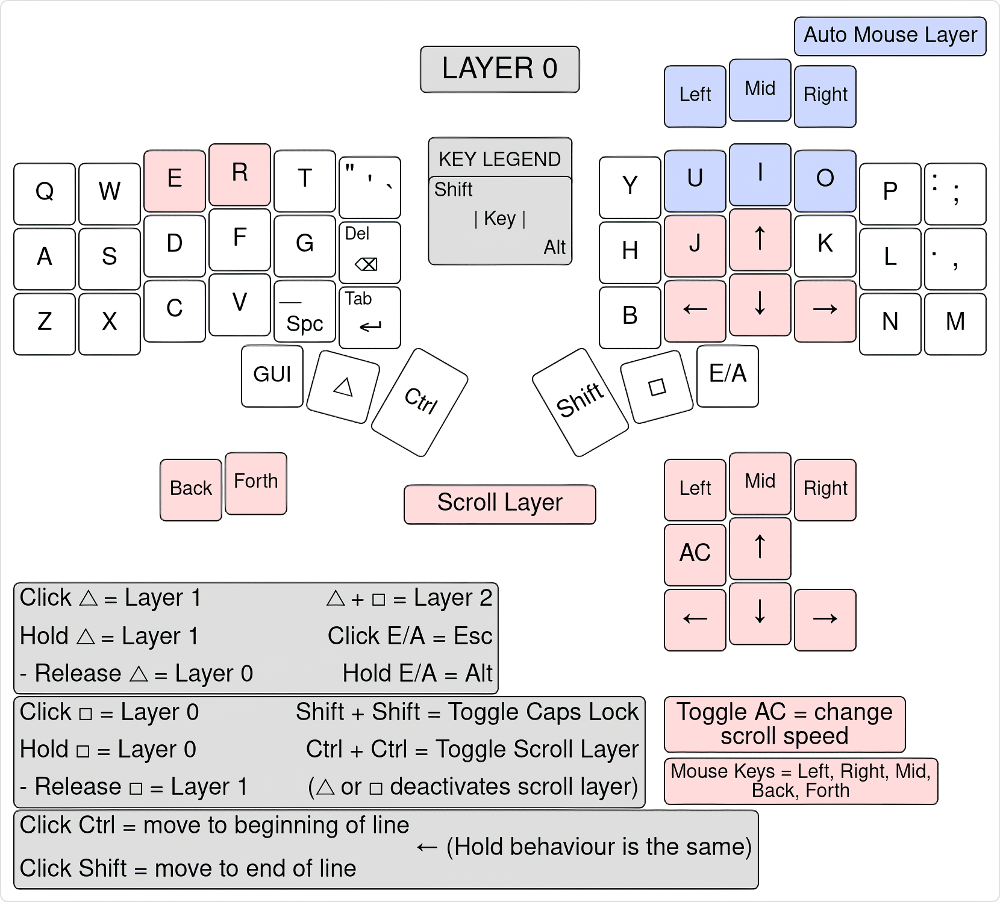
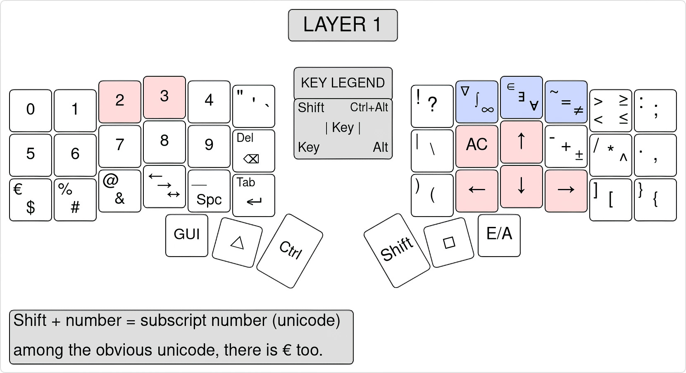
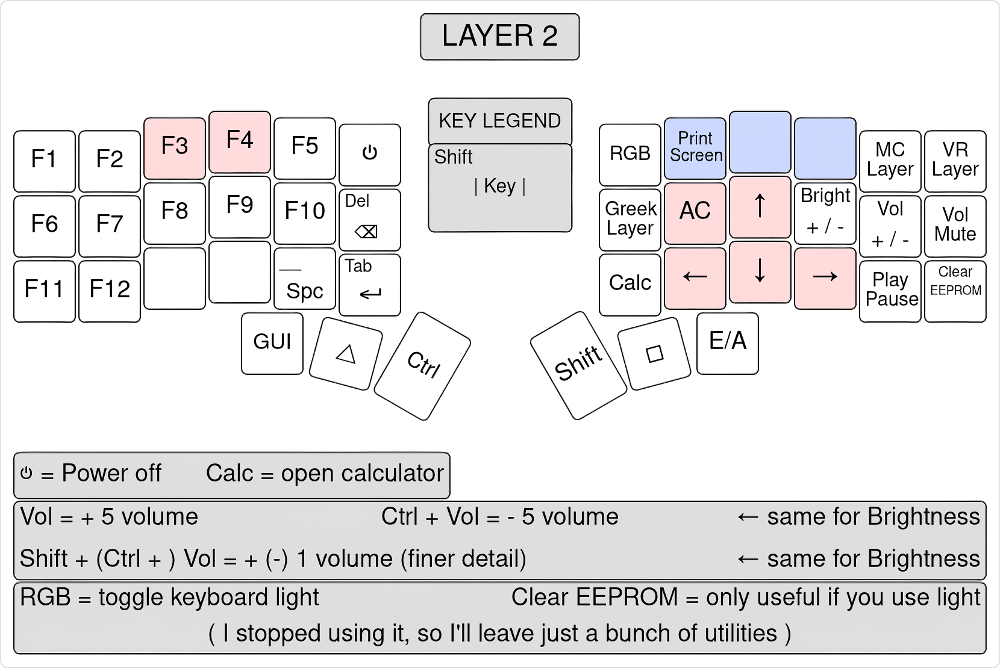
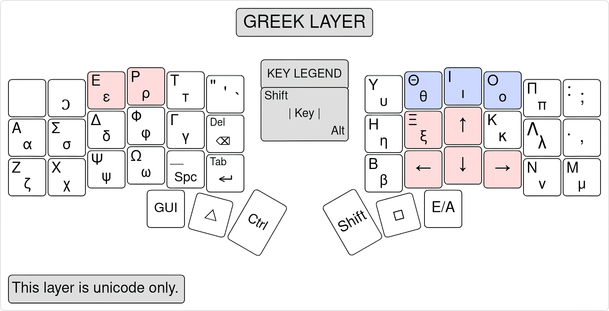
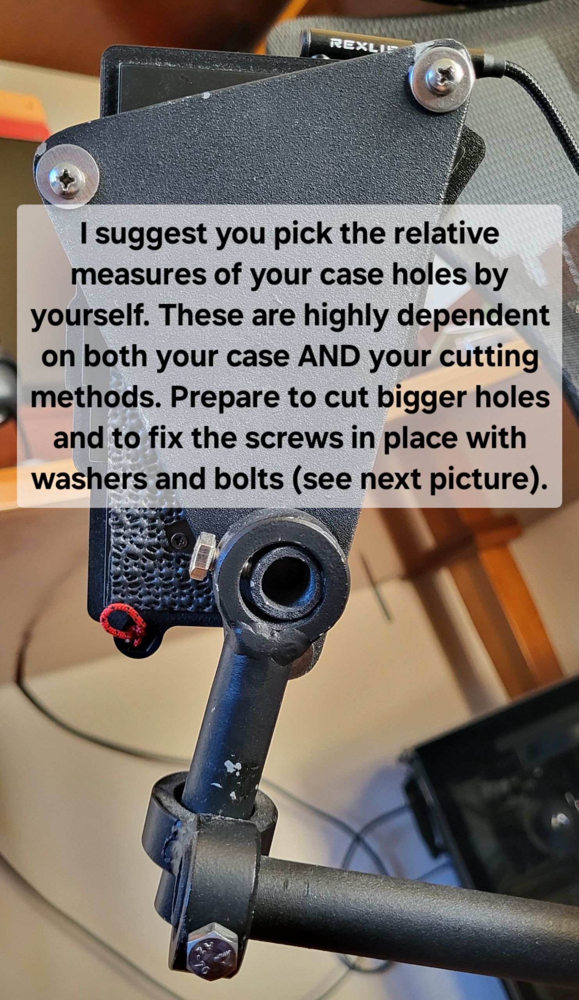

# Elil50 Corne keyboard QMK firmware


This project is subdivided as it follows:
1. An explaination of my custom firmware, written for the 6 columns [Corne keyboard](https://github.com/foostan/crkbd/) (a 42 keys ortholinear split keyboard), based on [QMK](https://github.com/qmk/qmk_firmware/) framework.
2. My hardware customization: from printable files for the case and the chair mount in picture, to key switches and keycaps, and even mounting tips for the trackpoint (optional).
3. My desktop enviroment shortcuts (optional).

> [!TIP]
> Overall my custom firmware is an easy and fast layout you can start using without gradually approaching ergonomic mechanical keyboards. You can jump directly from your big rectangular keyboard.

The easy firmware steps are:
1. Download this repository, including the ```qmk_firmware``` submodule.
2. Follow [QMK documentation](https://docs.qmk.fm/newbs_getting_started) for setting up your enviroment before flashing it to your keyboard. Note that Corne keyboards are called crkbd in the QMK framework.
3. Execute the file ```./flash.sh``` I prepared for you.


# Just a keyboard for show?


I coded, but my hands always felt lost on big keyboards: I couldn't learn touch typing and my eyes hurt each time I took a quick glance at the keyboard.<br/>
I coded, but my desk is comically high and I had the habit of pressing my wrists against its edges: my knuckles literally bled for months due to circulation issues. I tried using a comically high chair, but then it was my knees' turn to ache. I bought a footrest, but it didn't change anything.

That's when I went down the ergonomic keyboard rabbit hole and discovered split keyboards.

* I needed to mount it to my chair to stop worrying about the desk height.<br/>
* I needed just the right amount of keys: too few and it would reduce the typing speed, too many and I would lose my hands on it.<br/>
* I needed a split design to easily sit and stand, without moving a big rectangular slab over my legs.<br/>
* I needed a firmware framework to customize the keyboard layout to my heart's content.<br/>
* I needed a built-in pointing device to replace a standalone mouse. <br/>
* I needed something portable.
* I needed something easy to learn and use.

This is the solution I found and I'm learning touch typing for the first time in my life.


# :one: Keyboard firmware
When it comes to firmware, there are mainly 2 options: QMK(for wired keyboards) and ZMK(for wireless keyboards). My old laptop has a fried wireless module, so I chose the adaptability of wired over the comfort of wireless.

This was written for Corne V3. If you use a Corne V4 just add the 4 additional keys at the end of ```./Elil_50/keymap.c```.

I mount a pretty recent qmk version (end of 2025), but versions means nothing if it works. Updates introduce changes that either:
* solve someone else's issues.
* solve your issues.
* create new issues in someone else's code.
* create new issues in your code.

I have no issues to be solved here, so I don't need to gamble on the chance of having code breaking changes.

### QMK layers

QMK is an acronym for Quantum Mechanical Keyboard, but rest assured: it has nothing to do with the quantum world.

It is based on the idea that you have less physical keys than the ones you actually use. This already happens on normal keyboards, where you can switch from lower-case letters like ```a``` to upper-case ones like ```A``` by clicking the ```caps lock``` button, and where you can use the modifiers keys ```shift```, ```alt```, ```ctrl``` and ```fn``` with regular keys, to enable other features. This is nothing new either: just think of old nokia phones with just 12 physical keys.

In addition to regular modifiers, QMK features new ones called ```layer switching keys```, which change the virtual keys assigned to the physical ones. We can easily represent the keyboard layout with actual layers. Some of them can be applied like a mask and change few keys only, like the automatic mouse layer and the scroll layer described below. This is the most classical behaviour you can expect.

## Keyboard layout

This layout was optimized in 1 year, for coding and typing purposes. It works only if you set the OS language input to English(US).

Layouts like QWERTY, DVORAK, COLEMAK are designed around commonly used letters and words in order to reduce finger movement and strain. This is useless on a keyboard which is literally designed around your hand.<br/>
I only needed to assign commonly used keys - like modifiers and arrows - to strong fingers, and to avoid creating ankward positions when combining multiple modifiers with other keys.

Thus, I chose QWERTY to reduce the learning curve and improve compatibility with other devices.<br/>
For the same reasons, I avoided strange key combinations - like ```D+F=TAB``` - which may help you reduce the number of keys at the cost of increasing the keyboard complexity. I found that this keyboard has nearly the minimum number of keys to type fast without resorting to such tricks.

Indeed, the alphabetical layer - later called ```layer 0``` - cannot be reduced anymore without using combinations. On the other hand, the numerical one has so much space I filled it with unicode I sometimes use when talking to people.

In the following, I use the key ```GUI``` to refer to all the other aliases like ```meta```, ```command```, ```windows```, ```super```.









* ### Disabling Trackpoint and Unicode

The trackpoint can be disabled by turning false the flag ```MY_TRACKPOINT_ENABLE``` in ```./Elil_50/rules.mk```.<br/>
This option will not affect any other functionality.

Unicode symbols can be disabled by turning false the flag ```MY_UNICODE_ENABLE``` in ```./Elil_50/rules.mk```.<br/>
This option will not affect any other functionality.

Unicode support depends on both OS and software used: most recent Linux and Mac OS do support it by default, but you need to install Wincompose for Windows (another reason to avoid it). I use gedit as text editor: I switched from Kate because it doesn't recognise unicode really well.<br/>
The keymap I wrote does an automatic OS detection to use the right unicode input method.

* ### Automatic Mouse Layer

Enabled if ```MY_TRACKPOINT_ENABLE``` in ```./Elil_50/rules.mk``` is enabled. Highlighted in grey in the keyboard layout.

Whenever you move the trackpoint and 500ms after, this layer is activated. You can change this time by changing the number of ```TURN_LAYER_OFF_TIMEOUT``` at line 961 of ```./Elil_50/keymap.c```. <br/>
The layer switching key △ or ▢ deactivates it.

* ### Scroll Layer

If you double click the key ```GUI``` you activate the scroll layer, which replaces arrows with scroll movements, adds the key ```AC``` - which can be found by default in layer 1 - and mouse keys - the same of the automatic mouse layer. <br/>
If you double click the key ```GUI``` again or single click the layer switching key △ or ▢, the layer is deactivated.

If you toggle the key ```AC``` you change the scroll speed between fast and slow. You can change them by changing the numbers of the two ```MK_W_OFFSET``` in ```./Elil_50/config.h```.

* ### Overrides and combos

Let us consider a key click: first you press it, then you release it. If enough time has passed between the press and the release, the firmware will recognize you held it down.

**Override** is the QMK term which refers to the usual action of holding down a modifier key like ```alt``` or ```shift``` and then clicking a key to get a new output.

**Combo** is the QMK term which refers to the action of just clicking two keys together (i.e. at the same time) to get a new output.

I like to match combo and override outputs to increase my typing speed. Thus, in addition to holding down ```shift``` and then pressing ```a``` to get a capital ```A```, you can just click them together. By the way, if you double click ```shift``` you toggle ```caps lock```.

I found out that if you hold down the layer switching key △ to temporarily activate ```layer 1```, you need to wait too much time before you can press a combo: if you don't wait enough, the firmware will recognize your combo as if you are still on ```layer 0```. To overcome this issue - which received no answer from QMK developers - I just defined additional combos which involve the layer switching keys △ and ▢. They work so well, I'm glad they didn't know how to solve this issue:

* If you make a make a combo with △ and another key (or another combo), the firmware will understand you want that key (or that combo) from ```layer 1```. This action will not modify your current active layer. <br/>
If you make it with ▢, it's the same as before, but from ```layer 0```.

Both overrides and combos are written in ```.\Elil_50\keymap.c```, just follow the comments. You can change them as you like.

## User files and changes to qmk_firmware

The main selling point of flashable keyboards is the layout customization, so get comfy with writing in the last part of ```./Elil_50/keymap.c``` (which contains the layout implementation) and flashing it: it's really easy.

Instead of remapping softwares and videogames, additional layers can be added and reached from layer 2, which is activated by clicking the layer switching keys △ and ▢ together. If you want to return to layer 0 or 1 you just need to click ▢ or △ respectively.

Be sure to place the additional layers after layer 3 (i.e. the Greek layer. Follow my comments and it will make sense). I've left undefined ```XXXXXXX``` buttons in layer 2 which can be replaced with the toggle layer key ```TG(n)``` where ```n``` is the number of your additional layer.

This layout already has two gaming layer examples: you can understand the logic just by reading the layout implementation.

* ### Executables

**qmk_file_inject.sh:** injects user files (described below) in ```qmk_firmware```.

**flash.sh:** executes ```qmk_file_inject.sh``` and ```qmk flash``` in the user keyboard folder.

**commit_all.sh:** commits all changes, both of ```qmk_firmware``` submodule and ```crkbd_QMK module```.

Follow [QMK documentation](https://docs.qmk.fm/newbs_getting_started) for setting up your enviroment before flashing it to your keyboard. Note that Corne keyboards are called crkbd in the QMK framework.

> [!TIP]
> All the following actions are automatically performed by running ```./qmk_file_inject.sh```.

Before running a program, remember to change its execution permissions. For example, on Linux you run ```chmod +x program_name.sh```.

* ### Keymap.c, rules.mk, config.h

Add the folder ``` Elil_50 ``` in the following path:
```
./qmk_firmware/keyboards/crkbd/keymaps
```

* ### PS/2 Driver Trackpoint (optional)

The host needs pull-up resistors on PS/2 DATA and CLK lines. The built-in pullup resistors from the host 4k to 100k are acceptable.<br/>
In conclusion, you need to add those pull-up resistors (I didn't), or apply the following patch:

Add ```PAL_RP_PAD_PUE |``` in line 150 of file
```
./qmk_firmware/platforms/chibios/drivers/vendor/RP/RP2040/ps2_vendor.c
```
so that it looks like:
```c
    // clang-format off
    iomode_t pin_mode = PAL_RP_PAD_IE |
                        PAL_RP_GPIO_OE |
                        PAL_RP_PAD_SLEWFAST |
                        PAL_RP_PAD_DRIVE12 |
                        PAL_RP_PAD_PUE |
```

The PS/2 section of QMK is quite a mess, so you need to apply the following patches to file
```
./qmk_firmware/drivers/ps2/ps2_mouse.c
```
* Comment ```return``` in both line 92 and 105, so that it looks like:
```c
    } else {
        if (debug_mouse) print("ps2_mouse: fail to get mouse packet\n");
        /* return here to avoid updating the mouse button state */
        //return;
    }
```

---

<br>

# :two: Keyboard Hardware
The main components are:

* 2 PCB: Helidox Corne V3, 6 columns
* 2 Microcontroller: Elite-Pi
* 1 Trackpoint: SK8707-01-002(3.3V) Integrated (optional)
* 42 key switches and keycaps

There are tons of sites who sell DIY kits and pre-builts: each one has their own well-documented and similar guide on little details I won't write here. Nowadays even aliexpress sells low cost pre-builts, but be aware they are not easily flashable.

In my personal opinion the OLED of Corne V3 is useless: the keymap I wrote doesn't need a screen as a reminder of which layers you activated, and I want to focus on my screen, not my hands. Corne V4 replaced it with 2 additionak keys, but you need to stretch your hand a little to reach them. In conclusion, I didn't mount it and covered the microcontroller with a black acrylic.

## External shell (optional)


I 3D printed [this case](https://www.printables.com/model/347524-corne-keyboard-case-5-and-6-columns) and designed for portability purposes the light grey interlocking "case wall" depicted above. Note that you don't need to unplug the TRRS cable from the keyboard (the less mechanical stress, the longer the life span). You can find its file in ```./stl_files/eiga-wall-Elil50.stl```.

These files were made for Corne V3, which is not compatible with Corne V4. You can still port the ideas.

## Chair mount and other ideas (optional)

The community is wild when trying to find the ergonomic sweet spot and you could join the [cool guys](https://mgsloan.com/posts/tree-based-computing/) community too.

Split keyboards are, well... split. It's only natural to try mounting them on your legs.

After some attempts, I discovered the underneath of my leg - called ```semitendinous muscle``` - didn't like even the lightest tension. The leg mount idea was the reason for printing a keyboard case with holes. You can see a thin red rope I left attached to one of them: if necessity arises I can still tie them (I had old pictures without the trackpoint, so I'll just use them).


I even added some sponge to increase the leg grip and keyboard stability.


Some people mount them [below their desk](https://www.reddit.com/r/ErgoMechKeyboards/comments/1hyeo4n/custom_mount_for_typing_with_wrists_in_lap/), but that would ruin my precious chair-rocking sessions. I needed a chair mount and I hated armrests: those two things are complementary, and [not incompatible](https://www.reddit.com/r/ErgoMechKeyboards/comments/1lckoa4/joined_the_chair_mounted_split_gng/).

The rest of this section is useful if you can solder metal, know someone who can do it for you, or can 3D print with some tough materials. Otherwise it's just to give you a general idea.

First, you need to cut/print a slab with holes in the right place and screw it under your chair. This obviously depends on your chair.


The measures I found comfortable are the following.


You can see I used cylinders: they are helpful for changing their relative angles with ease. I soldered two of these "circles" together, to make screwable joints. Here, screwable means that if I screw hard enough - even without any hole in the metal cylinder - I lock stuff in place: it works, and you can see the little adjustments scratch away the black paint.


You need a slab under your keyboard too.




And it's done: now you just need to adjust relative distances and angles to your liking.

This setup doesn't prevent you to move around and place your keyboard wherever you want, maybe with some light to impress people. This setup is useful if you mainly write in one specific place.


## Key Switches and Keycaps
The world of key switches is really big. The important keywords you need to know are: low-profile(choc), standard profile (MX), tactile, linear, clicky, silent, lubed. I built a MX compatible one for aesthetics (most artisanal keycaps are cherry (MX) ) and bought tactile silent switches. However I forgot to check if they were pre-lubed: they were not and they feel scratchy as hell. I won't complain as I'm not building this keyboard for the mechanical switch pleasure, even though I admit the linear gateron of a friend of mine feel like heaven.

Keycaps have an equally vast range of options: I'll show some in the image below. I bought DSA profile keycaps from Aliexpress and scratched the home rows with sandpaper (1 minute at most of handwork).


## Trackpoint (optional)

I've placed the trackpoint on the left side of the keyboard because, as a right-handed person, I need the arrows on the right side: when coding and typing I find them far more useful than mouse movements.<br/>
I suggest to buy a standalone controller for gaming sessions with a lot of cursor movements.

In the following image you can see the back of the left side of the keyboard PCB with the pinout setup. The PCB already has a mounting hole we conveniently repurpose for the trackpoint stem.

More informations about the trackpoint can be found in the official datasheet; you can ask it to Sprintek directly.


* ### Trackpoint stem

> [!CAUTION]
> My 3D printed trackpoint stem just broke. I suggest to use metal. I'm going to buy a cheek piercer and try gluing it. I will update this section when it works.

Most of the guides I've read use wrong voltages (5V) or gloss over stem mounting, for the sole exception of [this detailed repo](https://github.com/wolfwood/navcaps) which I found too later. I hope to shed some light on this topic here, once and for all.

If your PCB has big enough holes - I increased the diameter with a drill on mine - you can safely go down the 3D printing route described by that repository. After having a 3D printed stem broken in half, I went down the metal route: just buy one cheek piercer with the right height and glue / [clamp](https://github.com/wolfwood/navcaps) it to the trackpoint sensor. There are also proptotypes of the SK8707-01-005(3.3V) going around, which should have a little screw as an integrated stem. There is no such item on the Sprintek site, but you just need to email them asking for it (you need to send an email for a normal trackpoint too). If possible, try this last approach as Plan A.

~~In order to raise the trackpoint keycap above the PCB, I 3D printed the following sketch. Then, I proceeded to cut the excess height and manually reduce the diameter of the section which goes through the PCB. It's probably better to print with 3mm instead of 4mm. I increased the diameter of the PCB hole with a drill. Finally I glued the stem on the trackpoint sensor: it was too shaky otherwise.~~

~~I leave just a sketch because I think a better design can be made.<br/>
Anyway, what I have now works.~~

You can find a printable Corne case with an integrated trackpoint mount [here](https://github.com/joh/crkbd-trackpoint?tab=readme-ov-file). If you are unsure about your PCB (for example with a Corne V4) or you already have a case, you can manually glue the trackpoint to it. For example I glued it to a metal plate that came with the DIY kit, screwed underneath the case mentioned in the previous sections. Just be sure to start by using some removable adhesive tape when placing the trackpoint. After a few attempts you find the right position: you don't want the stem to touch - or be too close to - the edges of the PCB hole. You can glue everything now.


---

<br>

# :three: Desktop Enviroment (KDE Plasma) (optional)


In ```KDE_Plasma``` folder you can find both monitor overview (which stores the widget positions) and keyboard shortcuts files. This is totally optional and it's more related to my typing experience than the keyboard. The two files are independent of each other.

* Replace ```./KDE_Plasma/overview.page``` in the following path:
```
.local/share/plasma-systemmonitor/overview.page
```

* Replace ```./KDE_Plasma/kglobalshortcutsrc``` in the following path:
```
.config/kglobalshortcutsrc
```

The customized OS Shortcuts are the following:

* Hold ```GUI``` + arrows = Switch Windows

* Hold ```GUI``` + click ```F```/```D``` = Toggle Windows Grid (In addition to ```F``` and ```D```, once pressed this combo you can even use arrows to navigate between the different windows inside the grid)

* Hold ```GUI``` + ```Shift``` + arrows = Switch Desktop

* ```GUI``` + ```N``` = Open Text Editor (Gedit)

* ```GUI``` + ```R``` = Open Terminal (Konsol)

---

<br>

# :star2: Thanks

I thank the whole open source ergonomic mechanical keyboard community for the projects they pushed out in the world and QMK developers for their support over their discord server. A special thanks to my friend Luca which helped me mounting and soldering the trackpoint, and gave me valuable github insight.
